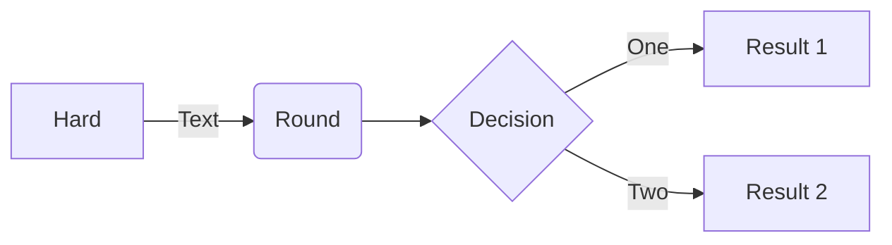

# Overview

TL;DR
A GCP BigQuery Dataform project outlining a technique for copy tables partitioned on _ingestion time_ while maintaining the original partitioning structure.

Often tables populated via streaming are partitioned using the ingestion time using a psuedo column called `_PARTITIONTIME` or `_PARTITIONDATE`. Either of these psuedo columns can be truncated to reflect lower resolution such as day. More information on ingestion time/date partitioning can be found here: https://cloud.google.com/bigquery/docs/partitioned-tables#ingestion_time

Copying tables partitioned on _ingestion time_ poses a challenge when using CTAS operations. These copy strategy inserts data into partitions in the sink table based on the when the data was copied _(not when the data was originally streamed)_. This typically results in all the source data landing in a single partition in the sink table _(assuming the operation finishes in 1 hour)_.

# Project Overview

# Merge Operation

The BigQuery `MERGE` statement is designed to copy data while maintining the partitining structure _(even when partition on ingestion time)_

# Setup



Source Table

```sql
CREATE TABLE
  dataform.secondary_transactions (name STRING,
    transaction_id STRING,
    date DATE)
PARTITION BY
  DATE_TRUNC(_PARTITIONTIME, HOUR)
```

Target Table

```sql
CREATE TABLE
  dataform.transactions (name STRING,
    transaction_id STRING,
    date DATE)
PARTITION BY
  DATE_TRUNC(_PARTITIONTIME, HOUR)
```

| Action Secret              | Value                                                          |
| -------------------------- | -------------------------------------------------------------- |
| CREDENTIALS_GPG_PASSPHRASE | Service Account Key used to authenticate GitHub to GCP Project |
