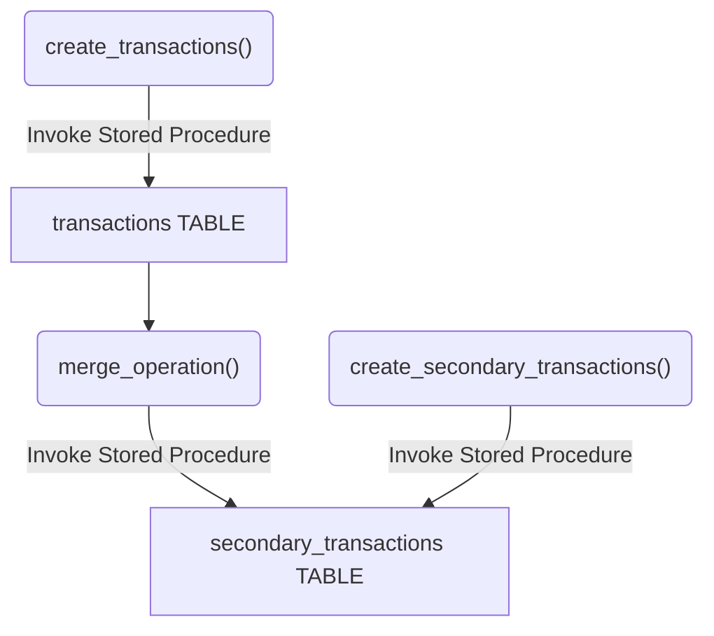

# Overview

TL;DR
A GCP BigQuery Dataform project outlining a technique for copy tables partitioned on _ingestion time_ while maintaining the original partitioning structure.

Often tables populated via streaming are partitioned using the ingestion time using a pseudo column called `_PARTITIONTIME` or `_PARTITIONDATE`. Either of these pseudo columns can be truncated to reflect lower resolution such as `DAY` or `HOUR`. More information on ingestion time/date partitioning can be found here: https://cloud.google.com/bigquery/docs/partitioned-tables#ingestion_time

Copying tables partitioned on _ingestion time_ poses a challenge when using CTAS operations. This copy strategy inserts data into partitions in the sink table based on when the data was copied _(not when the data was originally streamed)_. This typically results in all the source data landing in a single partition in the sink table _(assuming the operation finishes in 1 hour)_.

# Project Overview

The diagram below outlines the tables and SPROCs used in this project. The `transactions` table contains simulated data created by the `create_transactions()` SPROC. The data in this table is partitioned by ingestion hour _(see Setup section below)_. Run `create_transactions()` across different hours to invoke multiple partitions. Next the `merge_operation()` SPROC is called to merge results from the `transactions` table into the `secondary_transactions` table. Notice the number of partitions remains the same. The `create_secondary_transactions()` SPROC can then be called to continue inserting records into the copied table.

This entire process simulates copying ingestion time partitioned tables while maintaining the partitioning structure. The original number of partitions is unchanged and the new table will continue to partition new insertions according to the `_PARTITIONTIME` pseudo column. Refer to the Setup section for information on deploying this project into your own GCP environment.



# Merge Operation

The BigQuery `MERGE` statement is a DML statement designed to combine `INSERT`, `UPDATE`, and `DELETE`. More info can be found here: https://cloud.google.com/bigquery/docs/reference/standard-sql/dml-syntax#merge_statement).

It can also be used to copy data while maintaining the partitioning structure _(even when partitioning on ingestion time)_.

The `merge_operation()` SPROC used above calls the script shown below _(also in merge_operation.sqlx)_.

```sql
MERGE
  dataform.secondary_transactions T
USING
  dataform.transactions S
ON
  T.transaction_id = S.transaction_id
  WHEN NOT MATCHED
  THEN
INSERT
  (_PARTITIONTIME,
    name,
    transaction_id,
    date)
VALUES
  (_PARTITIONTIME,name,transaction_id,date);
```

Notice the `_PARTITIONTIME` column from the source is inserted into the sink. This ensures the original partitioning scheme is maintained. In this example the S stands for _Source_ and the T stands for _Target_.

# Setup

This project includes a yaml file for deployment to Google Cloud using dataform. The workflow requires an "Action Secret" used to set environment variables during deployment. Set the following secrets in the repository before deployment.

More information on configuring CI/CD for Datafrom can be found here: https://docs.dataform.co/guides/ci-cd.

| Action Secret              | Value                                                          |
| -------------------------- | -------------------------------------------------------------- |
| CREDENTIALS_GPG_PASSPHRASE | Service Account Key used to authenticate GitHub to GCP Project |

Next the following tables must be created in the GCP BigQuery instance.

Source Table

```sql
CREATE TABLE
  dataform.secondary_transactions (name STRING,
    transaction_id STRING,
    date DATE)
PARTITION BY
  DATE_TRUNC(_PARTITIONTIME, HOUR)
```

Target Table

```sql
CREATE TABLE
  dataform.transactions (name STRING,
    transaction_id STRING,
    date DATE)
PARTITION BY
  DATE_TRUNC(_PARTITIONTIME, HOUR)
```
